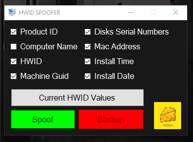
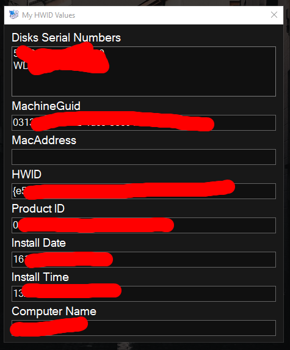
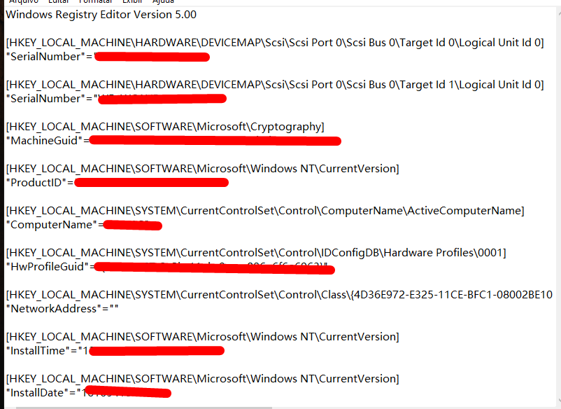

# HWID Spoofer

#### Basic HWID Spoofer written in C#
It works changing values from regedit!

Features:

- Product ID Spoofer
- Computer Name Spoofer
- HWID Spoofer
- Machine Guid Spoofer
- Disk Serial Number Spoofer
- Mac Address Spoofer
- Install Time Spoofer
- Install Date Spoofer
- ⭐ BACKUP OF YOUR ORIGINAL REGEDIT VALUES ⭐

Some images:

## Here you can see your current values

## Example of a backup file

